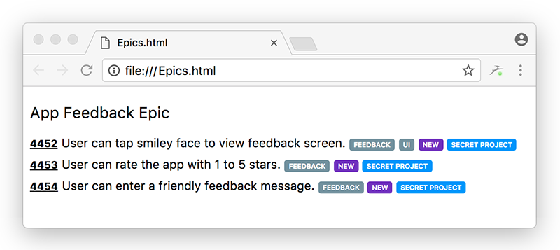

# Team Services App
A command line app for retrieving and exporting work items from Visual Studio Team Services. It currently supports hiearchical and flat queries with exporting to HTML, CSV, or for the Ideament app.

Usage
======
First edit the ```app.config``` file and set the ```TeamServicesPersonalAccessToken```, ```TeamServicesCollectionUrl```, and ```TeamServicesProjectName``` app settings. If you don't have a Personal Access Token you can create one in VSTS by clicking on your profile pic and clicking the Security link. The collection URL is the complete URL to your collection and the project name is the project that has the query you want to run. For example:

* PAT: djdie84maklx9d0pg73fisen8xp30vmw81f3q8xh93pf95hule8s
* URL: https://mycompany.visualstudio.com/DefaultCollection
* Project: MyProject

The app also has the ability to use Bitly to shorten the URL deep-links to the work items since they're somewhat unwieldly. If you want to use this then also set the ```BitlyAccessToken``` in the app settings. You can get a free token at http://dev.bitly.com.

Then run the app from the command-line as such:

```team-services-app "My Queries" "My Query" "html"```

where "My Queries" is the name of the folder in VSTS (under Work > Queries), "My Query" is the name of the query, and "html" is the export format ("csv" is also supported). The query can be hierarchical (two levels) with type "Tree of work items" and a tree type of "Parent/Child" or a simple flat query.

Example
=======

As an example, let's say we want a CSV that lists all the Features in our project. We would:

1. Create a new query
2. Set the type to "Tree of work items"
3. Add a top-level filter for "Work Item Type" In "Epic"
4. Add a linked item filter for "Work Item Type" In "Feature"
5. Set the filter options to "Match top-level work items first"
6. Set the type of tree to "Parent/Child"

This will produce a result that when viewed in VSTS looks like a 2-level tree:
```
4320  Epic     App Feedback Epic
4452  Feature      User can tap simley face to view feedback screen.
4453  Feature      User can rate the app with 1 to 5 stars.
4454  Feature      User can enter a friendly feedback message.
```

The resulting (denormalized) CSV file looks like:
```
4452, Feature, User can tap simley face to view feedback screen., App Feedback Epic, Feedback, UI, New, Secret Project
4453, Feature, User can rate the app with 1 to 5 stars., App Feedback Epic, Feedback, New, Secret Project
4454, Feature, User can enter a friendly feedback message., App Feedback Epic, Feedback, New, Secret Project
```

The resulting HTML file looks like:

